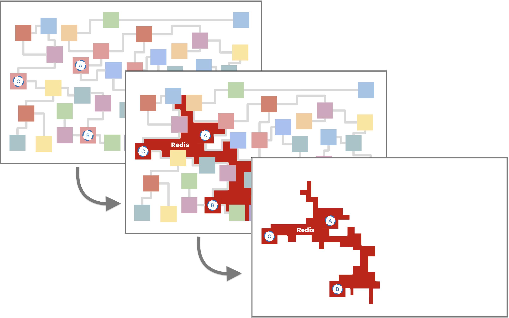

# Pluck


Pluck transforms Redis into an [HTAP](https://en.wikipedia.org/wiki/Hybrid_transactional/analytical_processing) Engine. *Execute and analyze your distributed functions at scale.*

## Install
[](https://badge.fury.io/js/%40hotmeshio%2Fpluck)

```sh
npm install @hotmeshio/pluck
```
## Documentation and Key Features
[SDK Documentation](https://hotmeshio.github.io/pluck-typescript/)

Pluck is a TypeScript library designed to simplify and accelerate the invocation and management of distributed functions across your cloud infrastructure. By leveraging Redis for function governance, Pluck offers a robust solution for operationalizing business logic at high speed within a microservices architecture. Key features include:

- `Easy Integration`: Seamlessly integrates into existing code bases, allowing for the refactoring of legacy systems without extensive overhaul.
- `Ad Hoc Network Creation`: Facilitates the creation of an operational data layer by connecting functions into a single, manageable mesh.
- `Durable Workflow Support`: Supports the transformation of functions into durable workflows with Redis-backed persistence.
- `Flexible Function Invocation`: Functions can be called remotely with ease, supporting both cached and uncached execution modes.
- `Workflow Extensions`: Offers a suite of workflow extension methods including hooks for extending functionality, signal handling for inter-process communication, and sleep for delaying execution.
- `Search and Indexing`: Provides tools for managing workflow state and leveraging Redis' search capabilities to query operational data.

Pluck is designed with the cloud developer in mind, offering a straightforward approach to enhancing the operability and maintainability of cloud-based functions.

## Understanding Pluck
Pluck inverts the relationship to Redis: those functions that once used Redis as a cache, are instead *cached and governed* by Redis. This inversion of control is particularly effective at refactoring a legacy code base.

Consider the following. It's a typical microservices network, with a tangled mess of services and functions. There's important business logic in there (functions *A*, *B* and *C* are critical), but it's hard to find and access.



Pluck creates an *ad hoc*, Redis-backed network of functions (your "operational data layer"). It's a simple, yet powerful, way to expose and unify your most important functions into a single mesh.

*Any service with access to Redis can join in the network, bypassing the legacy clutter.*

## Design
### Connect Your Functions
Easily expose your target functions. Here the legacy `getUser` function is registered as `user`.

```javascript
import * as Redis from 'redis'; //or `import Redis from 'ioredis'`
import { Pluck } from '@hotmeshio/pluck'

const pluck = new Pluck(Redis, { url: 'redis://:key_admin@localhost:6379' });

const getUser = async (id: string) => {
  //...fetch user from DB: { id: 'jsmith123', name: 'Jan Smith', ... }
  return user;
}

pluck.connect({
  entity: 'user',
  target: getUser,
});
```

### Execute
Call connected functions from anywhere on the network with a connection to Redis.

```javascript
import * as Redis from 'redis';
import { Pluck } from '@hotmeshio/pluck'

const pluck = new Pluck(Redis, { url: 'redis://:key_admin@localhost:6379' });

const response = await pluck.exec({
  entity: 'user',
  args: ['jsmith123'],
});

//returns { id: 'jsmith123', name: 'Jan Smith', ... }
```

### Execute and Cache
Provide an `id` and `ttl` flag in the format `1 minute`, `2 weeks`, `3 months`, etc to cache the function response. This is a great way to alleviate an overburdened database...and it's a familiar pattern for those who already use Redis as a cache.

```javascript
const response = await pluck.exec({
  entity: 'user',
  args: ['jsmith123'],
  options: { id: 'jsmith123', ttl: '15 minutes' },
});

//returns cached { id: 'jsmith123', name: 'Jan Smith', ... }
```

### Execute and Operationalize
Provide a `ttl` of `infinity` to operationalize the function. It's now a **durable workflow** with all the benefits of Redis-backed governance.

```javascript
const response = await pluck.exec({
  entity: 'user',
  args: ['jsmith123'],
  options: { id: 'jsmith123', ttl: 'infinity' },
});

//returns cached { id: 'jsmith123', name: 'Jan Smith', ... }
// AND REMAINS ACTIVE!
```

## Operationalize Your Functions: Data in Motion
Pluck does more than route function calls. Setting `ttl` to `infinity` converts the function into a *durable workflow*. Your function will now run as part of the Redis-backed operational data layer (ODL) and can only be removed by calling `flush`.

```javascript
const response = await pluck.flush( 'user', 'jsmith123');
```

### Hooks
Operationalized functions are "active" and can be extended using Hooks. Hooks are *subordinated-workflows* that run transactionally, with read/write access to the main function's state.

Consider the `user.bill` hook which sends *recurring* bills according to a user's chosen plan. It showcases a few of Pluck's workflow extension methods, including `search.get`, `search.set`, `getContext`, `sleepFor`, and `execChild`. *Effortlessly create recurring, transactional workflows without reliance on external schedulers.*

```javascript
//connect the `user.bill` hook function
pluck.connect({
  entity: 'user.bill',
  target: async (planId: string, plan: string, cycle: string) => {
    //persist the billing plan details
    const userId = Pluck.workflow.getContext().workflowId;
    const search = await Pluck.workflow.search();
    await search.set(
      'userId', userId,
      'planId', planId,
      'plan', plan,
      'cycle', cycle
    );
    let currentPlanId = planId;

    do {
      //call the `bill` workflow function
      await Pluck.workflow.execChild({
        entity: 'bill',
        args: [{ userId, planId, plan, cycle }]
      });

      //sleep for a month/year
      const duration = cycle === 'monthly' ? '1 month' : '1 year';
      await Pluck.workflow.sleepFor(duration);
      currentPlanId = await search.get('planId');

      //just woke up; continue if the plan's still active
    } while (currentPlanId === planId);
  }
});
```

Invoking hooks is straightforward. The following calls the `user.bill` hook, running it as a subordinated transaction, bound to the user, `jsmith123`. Hooks provide a reliable way to extend the functionality of the main workflow to which they are bound.

```javascript
//invoke the `user.bill` hook function
await pluck.hook({
  entity: 'user',
  id: 'jsmith123',
  hookEntity: 'user.bill',
  hookArgs: [uuidv4(), 'starter', 'monthly'],
});
```

### Composition
The `user.bill` *hook* calls `execChild` each time it awakens, invoking the `bill` workflow. This is an example of *composition* in Pluck, where a parent workflow spawns a child workflow using the `startChild` or `execChild` workflow extension methods. The `bill` workflow sends the user an invoice. If something goes wrong (for example, if the `sendInvoice` function call fails), Pluck will retry using an exponential backoff strategy until it succeeds.

```javascript
//connect the `bill` workflow function
pluck.connect({
  entity: 'bill',
  target: async (billingInputs: BillingInputs) => {
    const { userId, planId, plan, cycle } = billingInputs;
    //persist the billing plan details
    const search = await Pluck.workflow.search();
    await search.set(
      '$entity', 'bill',
      'userId', userId,
      'planId', planId,
      'plan', plan,
      'cycle', cycle,
      'timestamp', Date.now()
      );

    //send the bill exactly once (never double bill!)
    await Pluck.workflow.once<string>(sendInvoice, billingInputs);
  }
});
```

>💡If you're familiar with durable workflow engines like Temporal, you'll recognize the need to wrap activity calls, so they run exactly *once*. Pluck provides a few options, including `proxyActivities` and `once`. Assume for this example that that there is a legacy `sendInvoice` method that has been wrapped using `once` to ensure the user is never double-billed.

### Enhancing Functionality with Workflow Extensions
Workflow extension methods (like `sleepFor`, `search`, `execChild`, and `once`) are available to your operationalized functions. They provide a rich set of tools for managing workflow state and orchestrating complex, multi-process solutions.

 - `waitFor` Pause your function using your chosen signal key, and only awaken when the signal is received from the outide. Use a standard `Promise` to collate and cache the signals and only awaken your function once all signals have arrived.
    ```javascript
    const { waitFor } = Pluck.workflow;

    const [signal1, signal2] = await Promise.all([
      waitFor<{payload: string}>('sig1'),
      waitFor<number>('sig2')
    ]);
    ```
 - `signal` Send a signal (and optional payload) to a paused function awaiting the signal.
    ```javascript
      await Pluck.workflow.signal('sig1', {payload: 'hi!'});
    ```
 - `hook` Redis governance converts your functions into 're-entrant processes'. Optionally use the *hook* method to spawn parallel execution threads to augment a running workflow. Hooks share the same memory (the same Redis record) as the main workflow, and can read/write to the same state.
    ```javascript
    await Pluck.workflow.hook({
      entity: 'user.bill.cancel',
      args: []
    });
    ```
 - `sleepFor` Pause function execution for a ridiculous amount of time (months, years, etc). There's no risk of information loss, as Redis governs function state. When your function awakens, function state is efficiently (and automatically) restored and your function will resume right where it left off.
    ```javascript
    await Pluck.workflow.sleepFor('1 month');
    ```
 - `random` Generate a deterministic random number that can be used in a reentrant process workflow (replaces `Math.random()`).
    ```javascript
    const random = await Pluck.workflow.random();
    ```
 - `once` Execute a function once and only once. *This is a light-weight replacement for proxyActivities that executes without CQRS indirection. No setup is needed as is required for proxyActivities; call any function as shown.* In the following example, the `sendBill` function is called once and only once.
    ```javascript
    const result = await Pluck.workflow.once<string>(sendBill, billingInputs);
    ```
 - `execChild` Call another durable function and await the response. *Compose sophisticated, multi-process solutions by calling child workflows.*
    ```javascript
    const jobResponse = await Pluck.workflow.execChild({
      entity: 'bill',
      args: [{ userId, planId, plan, cycle }],
    });
    ```
 - `startChild` Call another durable function, but do not await the response. *Compose sophisticated, multi-process solutions by calling child workflows.*
    ```javascript
    const jobId = await Pluck.workflow.startChild({
      entity: 'bill',
      args: [{ userId, planId, plan, cycle }],
    });
    ```
 - `getContext` Get the current workflow context (e.g., `workflowId`, `namespace`, `topic`, `replay`).
    ```javascript
    const context = await Pluck.workflow.getContext();
    ```
 - `search` Instance a search session
    ```javascript
    const search = await Pluck.workflow.search();
    ```
    - `set` Set one or more name/value pairs
      ```javascript
      await search.set('name1', 'value1', 'name2', 'value2');
      ```
    - `get` Get a single value by name
      ```javascript
      const value = await search.get('name');
      ```
    - `mget` Get multiple values by name
      ```javascript
      const [val1, val2] = await search.mget('name1', 'name2');
      ```
    - `del` Delete one or more entries by name and return the number deleted
      ```javascript
      const count = await search.del('name1', 'name2');
      ```
    - `incr` Increment (or decrement) a number
      ```javascript
      const value = await search.incr('name', 12);
      ```
    - `mult` Multiply a number
      ```javascript
      const value = await search.mult('name', 12);
      ```

## Search
Pluck helps manage workflow state, by providing search extensions like `get`, `set`, and `del` to your operationalized functions. In addition, for those Redis backends with the *RediSearch* module enabled, Pluck provides abstractions for simplifying full text search.

For example, the `user` function shown in prior examples can be indexed to find users who are subscribed to the `starter` plan.

### Indexing
The index is a JSON abstraction that simplifies the RediSearch API. Fields that are saved using `Pluck.workflow.search().set` can be indexed (and searched) if declared as follows. (The following declaration states that 4 fields will be indexed for every `user`.

```javascript
const schema = {
  schema: {
    userId: { type: 'TAG', sortable: true },
    planId: { type: 'TAG', sortable: true },
    plan: { type: 'TAG', sortable: false },
    cycle: { type: 'TAG', sortable: false },
  },
  index: 'user',
  prefix: ['user'],
};

await pluck.createSearchIndex('user', {}, schema);
```

>Call this method at server startup or from a build script as it's a one-time operation. Pluck will log a warning if the index already exists or if the chosen Redis deployment does not have the RediSearch module enabled.

### Searching
Once the index is created, records can be searched using the  [RediSearch](https://redis.io/commands/ft.search/) query syntax. This example paginates through all users who are subscribed to the `starter` plan. 

```javascript
//paginate users where...
const results = await pluck.findWhere('user', {
 query: [{ field: 'plan', is: '=', value: 'starter' }],
 limit: { start: 0, size: 100 },
 return: ['userId', 'planId', 'plan', 'cycle']
});

// returns
// { 
//   count: 1,
//   query: 'FT.SEARCH user @_plan:{starter} RETURN 4 _userId planId, _plan, _cycle LIMIT 0 100',
//   data: [{ userId: 'jsmith123', planId: '472-abc-3d81e', plan: 'starter', cycle: 'monthly' }]
// }

//paginate all users (by omitting the `query` field)
const results = await pluck.findWhere('user', {
 limit: { start: 0, size: 100 },
 return: ['userId', 'planId', 'plan', 'cycle']
});
```

> Pluck provides a JSON abstraction for building queries (shown here), but you can also use the raw RediSearch query directly that is returned in the response. It's all standard Redis behind the scenes.

## Examples and Use Cases
Refer to the [Pluck JavaScript Examples](https://github.com/hotmeshio/samples-javascript/blob/main/test.js) for the simplest, end-to-end example that demonstrates the use of Pluck to operationalize a function, create a search index, and query the index.

For a more in-depth example that demonstrates `hooks`, `signals`, and many of the other workflow extension methods, refer to the the [Pluck TypeScript Examples](https://github.com/hotmeshio/samples-typescript/tree/main/services/pluck).

## Build, Test and Extend
The source files include a docker-compose that spins up one Redis instance and one Node instance. The RediSearch module is enabled. Refer to the unit tests for usage examples for getting/setting data, creating a search index, and optimizing activity calls with proxy wrappers.

Deploy the container:

```bash
docker compose up --build -d
```

Run the tests within the container:

```bash
docker compose exec pluck npm run test
```

Build from source within the container:

```bash
docker compose exec pluck npm run clean-build
```
