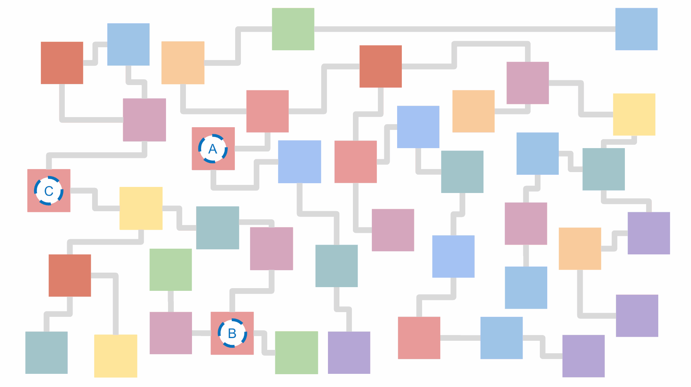

# Pluck


Call and cache functions across your microservices network. *Pluck helps **connect**, **organize** and* **operationalize** *your data*. 

## Install
[](https://badge.fury.io/js/%40hotmeshio%2Fpluck)

```sh
npm install @hotmeshio/pluck
```

## Background
Pluck works by inverting the relationship to Redis: those functions that once used Redis as a cache, are instead cached by Redis. This is a powerful inversion of control, and it's the key to Pluck's simplicity and effectiveness, particularly when refactoring a legacy code base.

Consider the following. It's a typical microservices network, with a tangled mess of services and functions. There's important business logic in there (functions like *A*, *B* and *C* critical!), but they're hard to find and access.



Pluck creates an *ad hoc*, Redis-backed network of functions (your "operational data layer"). It's a simple, yet powerful, way to expose, unify and extend your most important functions.

## Design
### Connect
Connect and expose target functions. Here the `greet` function is registerd as 'greeting'.

```javascript
import Redis from 'ioredis'; //OR `import * as Redis from 'redis';`
import Pluck from '@hotmeshio/pluck'

const pluck = new Pluck(Redis, { host: 'localhost', port: 6379 });

const greet = (email: string, user: { first: string, last: string}) => {
  return `Hello, ${user.first} ${user.last}. Your email is [${email}].`;
}

pluck.connect('greeting', greet);
```

### Execute and Cache
Call connected functions from anywhere on the network. Cache using a `ttl` flag in the format `1 minute`, `2 weeks`, `3 months`, `infinity`, etc.

```javascript
import Redis from 'ioredis';
import Pluck from '@hotmeshio/pluck'

const pluck = new Pluck(Redis, { host: 'localhost', port: 6379 });

const response = await pluck.exec(
  'greeting', 
  ['jsmith@pluck', {first: 'Jared', last: 'Smith'}],
  { ttl: '15 minutes' }
);
//returns 'Hello, Jared Smith. Your email is [jsmith@pluck].'
```

### Flush, Execute, and Cache
Add `flush` to ensure the cache is cleared and the function is called anew. This is useful when you want to ensure the function is called, and the cache is updated.

```javascript
const response = await pluck.exec(
  'greeting', 
  ['jsmith@pluck', {first: 'Jared', last: 'Smith'}],
  { ttl: '15 minutes', flush: true }
);
```

### Idempotent Execution
Pluck runs every function as an *idempotent workflow*, using a deterministic GUID generated by hashing the input arguments. If you don't change the input arguments, you'll get the same response (likely from the Redis cache). Add an optional `id` field to uniquely identify an idempotent execution.

```javascript
const response = await pluck.exec('greeting', 
  ['jsmith@pluck', {first: 'Jared', last: 'Smith'}],
  { ttl, 'infinity', id: 'jsmith123' }
);
```

## Operationalize Your Data
Setting `ttl` to 'infinity' will cache the function response indefinitely as a **durable workflow** (until it is explicitly removed using `pluck.flush`). During this time you can bind *Hooks* to the workflow to extend its functionality.

Hooks are *subroutines* that run as parallel transactions with read and write access to shared function state. Consider the `greet` function which has been updated to persist the user's email and sign them up for a recurring newsletter (using a **Hook**).

```javascript
functon greet (email: string, user: { first: string, last: string}) {
  //persist the user's email and newsletter preferences
  const search = await Pluck.MeshOS.search();
  await search.set('email', email, 'newsletter', 'yes');

  //set up a recurring newsletter subscription using a 'hook'
  await Pluck.MeshOS.hook({ workflowName: 'newsletter.subscribe', args: []});

  return `Hello, ${user.first} ${user.last}. Your email is [${email}].`;
}
```

**Hooks** are authored as ordinary JavaScript functions, but since they run as reentrant processes, you can include `Pluck.MeshOS` extensions. This example also showcases something you wouldn't expect: it sends a newsletter and then *sleeps for a month*. With just a few lines of code, you've added a thread-safe, transactionally-backed, recurring subroutine.

```javascript

const sendNewsLetter = async () => {
  const search = await Pluck.MeshOS.search();
  do {
    const email = await search.get('email');
    console.log('call your newsletter service =>', email);
    await Pluck.MeshOS.sleep('1 month');
  } while(await search.get('newsletter') === 'yes');
}

pluck.connect('newsletter.subscribe', newsLetter);
```

Cancelling the subscription is equally straightforward: create and connect a function that sets `newsletter` to 'no'.

```javascript
pluck.connect('newsletter.unsubscribe', async () => {
  await Pluck.MeshOS.set('newsletter', 'no');
});
```

Call the `newsletter.unsubscribe` hook from anywhere on the network (it's now part of your operational data layer). It can also be called from within your connected functions or inside another hook.


```javascript
await pluck.hook('greeting', 'jsmith123', 'newsletter.unsubscribe', []);
```

## Build and Test
The source files include a docker-compose that spins up one Redis instance and one Node instances. The RediSearch module is enabled.

Deploy the container:

```bash
docker-compose up --build -d
```

Run the tests (from within the container):

```bash
npm run test
```

Build from source (from within the container):

```bash
npm run clean-build
```
